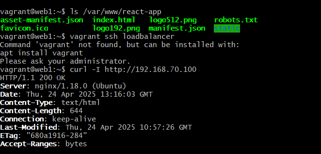
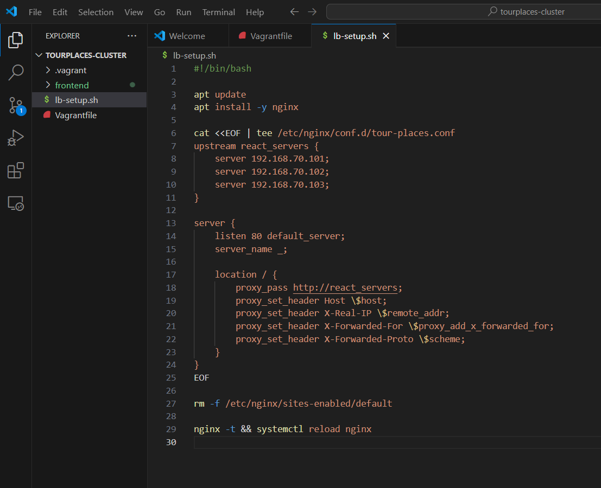
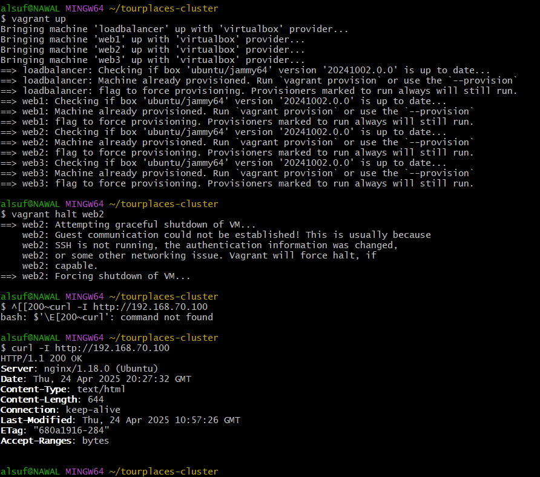

# 🚀 TourPlaces - Vagrant Cluster Deployment

Welcome to the **TourPlaces Cluster Setup**!  
This project simulates a production-ready infrastructure for a travel recommendation platform using **Vagrant + NGINX** 🛫🌍

---

## 📦 Project Structure

```bash
.
├── Vagrantfile
├── lb-setup.sh
├── frontend/     # React app folder (cloned from repo)
├── screenshots/  # Screenshots required for submission
└── README.md

```
------------------------------------------
🔧 Setup Overview
We used 4 virtual machines:

Load Balancer (IP: 192.168.70.100, 2GB RAM)

🖥 Web Servers
3 instances serving the React app
IPs: 192.168.70.101 → 192.168.70.103
Memory: 1GB each

💡 All machines use ubuntu/jammy64 and are accessible via SSH
------------------------------------------
⚙️ Vagrantfile Breakdown

- Uses a loop to define multiple VMs
- Installs **NGINX** + **curl** on all machines
- Web servers:
  - Sync with `./frontend/build` → `/var/www/react-app`
  - Replace default NGINX root with symbolic link
- Load Balancer:
  - Runs `lb-setup.sh` to configure NGINX

📄 **See full code in**: `Vagrantfile`

------------------------------------------
🌐 Load Balancer - NGINX Config

NGINX configured to:

Balance traffic between 3 backend servers

Preserve original request headers

Remove the default welcome page

🛠️ See script: lb-setup.sh
------------------------------------------
## 🖼️ Screenshots

### ✅ vagrant-status


### 🌐 curl-loadbalancer


### 🌍 google-ping


### 📄 lb-setup-script



### ⚠️ Failure Test (Simulate Web2 Down)



------------------------------------------
🧪 Testing & Scaling

Tested with curl -I http://192.168.70.100

Simulated failure: `vagrant halt web2`, then confirmed response using `curl -I`

Verified with curl loop:

for i in {1..10}; do curl -I http://192.168.70.100; done

Scaling: Added web4 (IP: 192.168.70.104) dynamically using sed:

sed -i '/upstream react_servers {/a     server 192.168.70.104;' /etc/nginx/conf.d/tour-places.conf
systemctl reload nginx
------------------------------------------
📝 Notes
💡 All provisioning automated via shell scripts

🔐 Secure headers preserved for production

🚀 Infrastructure is scalable and modular

💻 Hosted on: Windows 11 Home + Git Bash + VirtualBox


💪 This setup proves your DevOps superpowers. Onward to the bonus! 🌟


